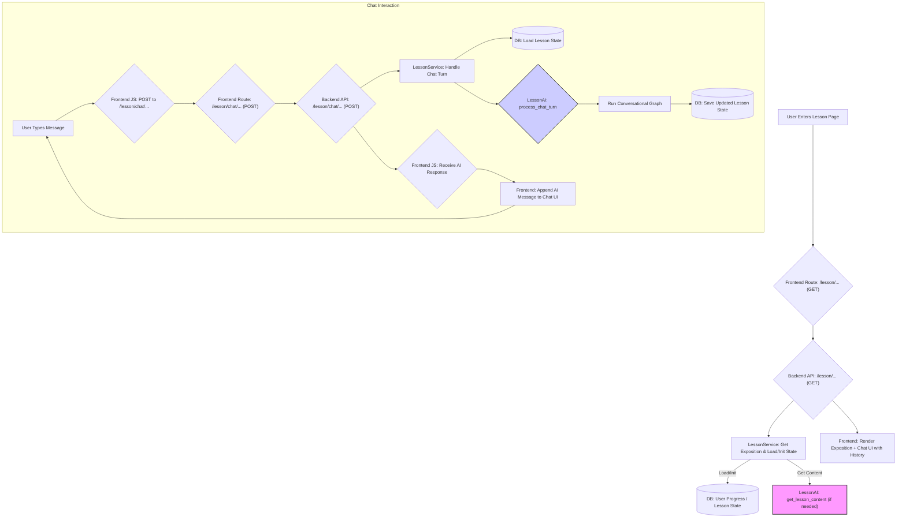

# Plan: Implement Conversational Lesson Interface

**Goal:** Transform the static lesson page into a conversational experience where the exposition is shown, followed by a chat interface. The AI initiates the chat, offering choices (ask questions, do exercises, take quiz), and manages the interaction based on user responses, leveraging the `LessonAI` component.

**Current Situation:**

1.  **UI (`lesson.html`):** Displays static sections for Exposition, Exercises (with individual submit buttons), and a Knowledge Assessment (quiz form).
2.  **Backend (`lesson_service.py`):**
    *   Uses `LessonAI` (`_generate_lesson_content`) via `get_or_generate_lesson` to create the initial lesson structure (exposition, exercise definitions, quiz definitions).
    *   Has a separate endpoint (`/exercise/evaluate`) that takes a specific exercise answer and uses the AI model *directly* (not via the `LessonAI` graph) to evaluate it.
3.  **AI (`lessons_graph.py`):**
    *   The `LessonAI` class uses `langgraph` to define a workflow primarily for one-time generation of lesson content.
    *   It includes an `evaluate_response` node, but it's not integrated into a conversational loop.
    *   It lacks the logic to manage a back-and-forth chat or maintain conversational context effectively for the requested interaction model.

**Proposed Plan:**

This requires modifications across the stack: AI graph, backend service/API, and frontend UI.

**Phase 1: Backend AI Modifications (`lessons_graph.py` & `LessonAI`)**

1.  **Redesign `LessonState`:**
    *   Add `conversation_history: List[Dict]` to store messages (e.g., `{'role': 'user'/'assistant', 'content': '...'}`).
    *   Add `current_interaction_mode: str` (e.g., 'chatting', 'doing_exercise', 'taking_quiz').
    *   Add `current_exercise_index: Optional[int]` and `current_quiz_question_index: Optional[int]`.
2.  **Redesign `langgraph` Workflow:** Create a cyclical graph to manage the conversation turn-by-turn.
    *   **Nodes:**
        *   `start_conversation`: Generates the initial AI message offering choices.
        *   `process_user_message`: Receives user input, updates `conversation_history`.
        *   `route_message`: Determines the next action based on `current_interaction_mode` and user message content.
        *   `generate_chat_response`: Uses the AI model to generate a relevant response based on history and context.
        *   `present_exercise`: Selects the next exercise, formats it for chat, updates `current_interaction_mode`.
        *   `present_quiz_question`: Selects the next quiz question, formats it, updates `current_interaction_mode`.
        *   `evaluate_chat_answer`: Uses the AI model to evaluate an answer given in the chat, provides feedback.
        *   `update_progress`: Updates user progress based on evaluations.
    *   **Edges:** Create conditional edges based on the output of `route_message`. The graph will loop back to `process_user_message` after the AI responds.
3.  **Modify `LessonAI` Class:**
    *   Add a new primary method, e.g., `process_chat_turn(state: LessonState, user_message: Optional[str]) -> LessonState`, which runs the new conversational graph.
    *   Keep `get_lesson_content` for initial generation of exposition and exercise/quiz definitions.
4.  **Update AI Prompts:** Design new prompts for conversational nodes (`generate_chat_response`, `route_message`, `evaluate_chat_answer`) that leverage `conversation_history`.

**Phase 2: Backend Service & API Modifications (`lesson_service.py`, `main.py`)**

1.  **State Management:** Persist `LessonState` (including `conversation_history`, `current_interaction_mode`) between chat requests, likely in the `user_progress` table in the database (e.g., as JSON blobs).
2.  **New API Endpoint:** Create `/lesson/chat/{lesson_id}` (POST).
    *   Accepts `{ "message": "user input" }`.
    *   Retrieves the current `LessonState` from the DB.
    *   Calls `LessonAI.process_chat_turn`.
    *   Saves the updated `LessonState` back to the DB.
    *   Returns the latest AI message(s) from the updated `conversation_history`.
3.  **Modify `/lesson/{syllabus_id}/{module}/{lesson_id}` (GET):**
    *   Fetch/generate base lesson content (exposition, exercise/quiz definitions).
    *   Retrieve the current `LessonState` (or initialize).
    *   If history is empty, call `LessonAI.process_chat_turn` with `user_message=None` to get the initial AI greeting.
    *   Return exposition *and* current conversation history.

**Phase 3: Frontend Modifications (`lesson.html`, JS, `lessons.py`)**

1.  **Update `lesson.html`:**
    *   Display the `exposition` content.
    *   Replace static exercise/quiz sections with a chat UI component.
    *   Render initial `conversation_history`.
    *   Include a text input for the user.
2.  **Add/Modify JavaScript:**
    *   Render initial `conversation_history`.
    *   On user message send:
        *   Display user message.
        *   POST message to `/lesson/chat/{lesson_id}` frontend route.
        *   Show "thinking..." indicator.
        *   Receive AI response(s).
        *   Append AI response(s) to chat UI.
3.  **Update `frontend/lessons/lessons.py`:**
    *   Modify the `lesson` route (`/<syllabus_id>/<module>/<lesson_id>`) to fetch exposition and conversation history and pass them to the template.
    *   Add a new route for `/lesson/chat/{lesson_id}` (POST) to forward messages to the backend API chat endpoint.

**Flow Diagram:**

**Key Decisions:**

*   **State Persistence:** Conversation state will be stored in the database (`user_progress` table).
*   **Evaluation Integration:** Exercise/quiz evaluation will be integrated into the chat flow via the `LessonAI` graph.
*   **UI Richness:** Start with simple text-based presentation of exercises/questions in the chat. Richer UI elements can be considered later.