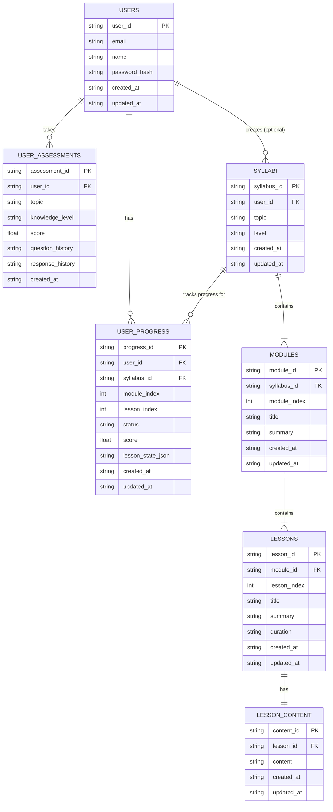

# Database Schema (Mermaid Diagram)

**Explanation of Relationships:**

*   `users` to `user_assessments`: One user can take zero or more assessments.
*   `users` to `user_progress`: One user can have zero or more progress entries.
*   `users` to `syllabi`: One user can optionally create zero or more syllabi (some syllabi might be general, not user-specific).
*   `syllabi` to `modules`: One syllabus contains one or more modules.
*   `syllabi` to `user_progress`: One syllabus can have zero or more progress entries associated with it (across different users).
*   `modules` to `lessons`: One module contains one or more lessons.
*   `lessons` to `lesson_content`: One lesson has exactly one content entry (based on the current upsert logic in `save_lesson_content`).

**Notes:**

*   Data types like `TEXT`, `INTEGER`, `REAL` are inferred based on common SQLite usage and the Python code. `TEXT` is often used for UUIDs and timestamps (ISO format).
*   `FK` denotes a Foreign Key relationship.
*   `PK` denotes a Primary Key.
*   The `lesson_content` to `lessons` relationship is marked as `||--||` (one-to-one) because the current code updates existing content rather than creating multiple versions per lesson.
*   The `user_progress` table uses `syllabus_id`, `module_index`, and `lesson_index` to identify the specific lesson for progress tracking, rather than a direct `lesson_id` foreign key. This might be a design choice to simplify progress lookup based on the syllabus structure known by the application layer.