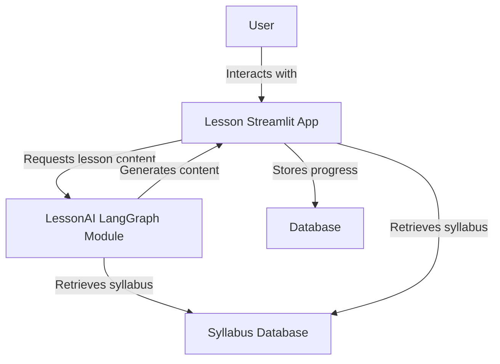
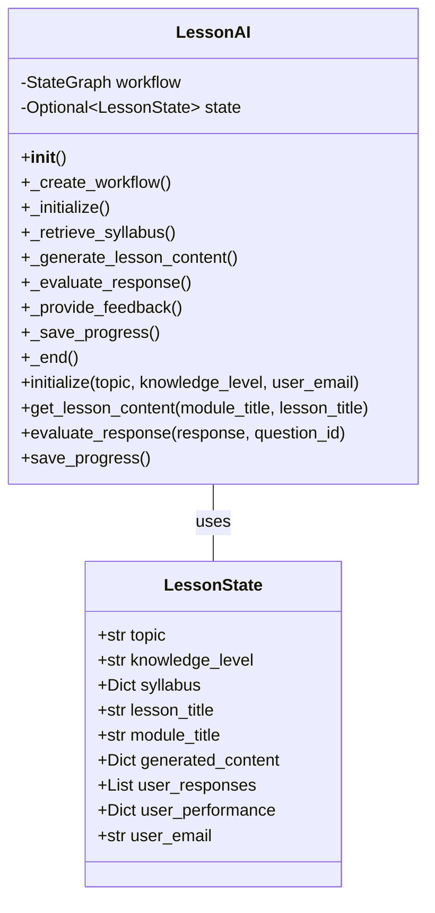
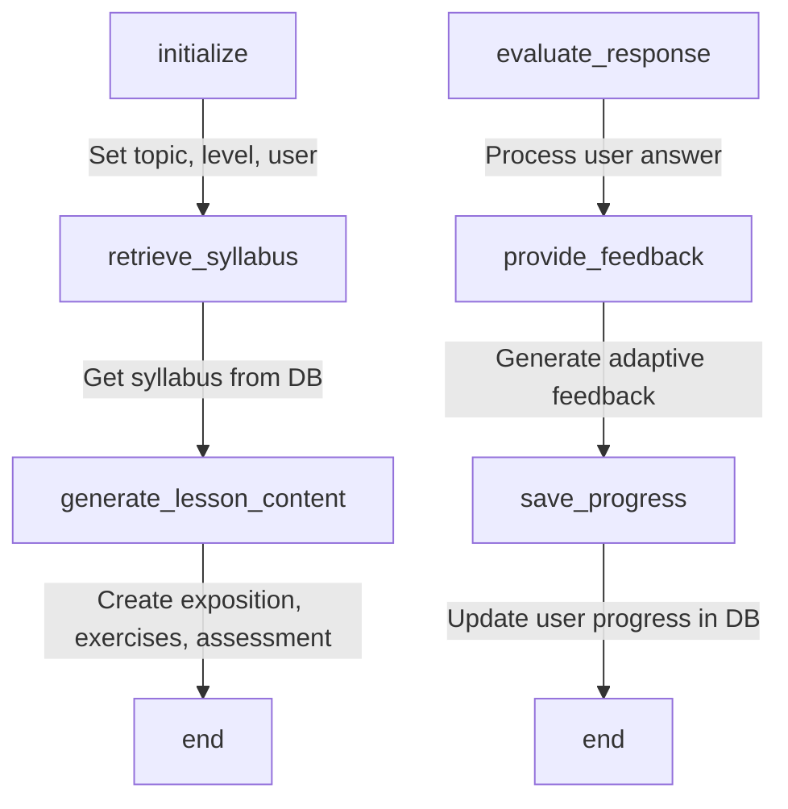
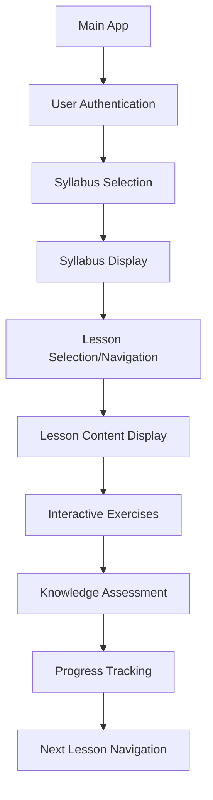
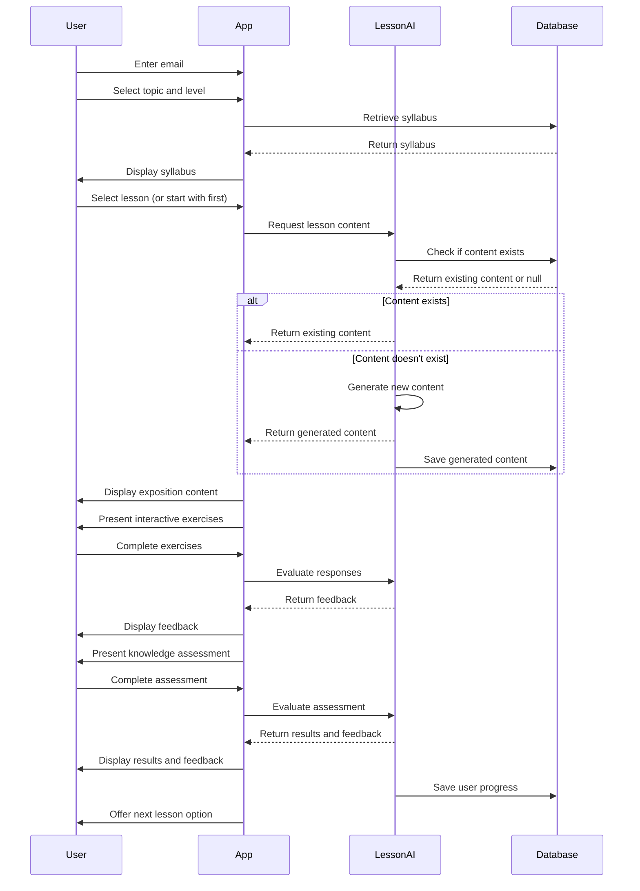

# Detailed Implementation Plan: Lesson Demo with LangGraph AI Module

Based on your requirements, I've outlined a comprehensive plan for implementing the lesson demo with a LangGraph AI module as specified in PRD section 4.3. This will be a new Streamlit app that works with the existing syllabus database.

## 1. Overall Architecture



## 2. LangGraph AI Module for Lesson Generation

### 2.1 LessonAI Class Structure

We'll create a new LangGraph-based AI module in `lessons/ai/langgraph_app.py` that will:

1. Generate lesson content based on the syllabus, lesson title, and user knowledge level
2. Create interactive exercises and assessments
3. Provide adaptive feedback based on user responses
4. Track user progress



### 2.2 LangGraph Workflow

The LessonAI will have a workflow with the following nodes:



### 2.3 Database Schema Extension

We'll extend the database to track user progress:

```json
{
  "syllabi": { ... },
  "user_progress": {
    "user1@example.com": {
      "Black Holes_Early Learner": {
        "completed_lessons": [
          "What is Space?",
          "Stars and Planets: A First Look"
        ],
        "current_lesson": "What is Gravity? (Simple Explanation)",
        "performance": {
          "What is Space?": {
            "score": 0.85,
            "completed_at": "2025-03-21T10:15:00Z"
          },
          "Stars and Planets: A First Look": {
            "score": 0.92,
            "completed_at": "2025-03-21T10:30:00Z"
          }
        }
      }
    }
  }
}
```

## 3. Streamlit UI for Lesson Experience

### 3.1 Lesson Demo App Structure

We'll create a new Streamlit app in `lessons/streamlit_app/app.py` with the following components:



### 3.2 User Flow



## 4. Implementation Steps

### 4.1 Create LessonAI Module

1. Create `lessons/ai/__init__.py`
2. Create `lessons/ai/langgraph_app.py` with the LessonAI class
3. Implement the LangGraph workflow for lesson generation
4. Add methods for evaluating responses and providing feedback
5. Implement progress tracking and database integration

### 4.2 Create Lesson Streamlit App

1. Create `lessons/streamlit_app/__init__.py`
2. Create `lessons/streamlit_app/app.py` with the Streamlit UI
3. Implement user authentication flow
4. Create syllabus selection and display components
5. Implement lesson navigation and content display
6. Add interactive exercise and assessment components
7. Implement progress tracking and visualization

### 4.3 Create Lesson Demo Entry Point

1. Create `lesson_demo.py` as the entry point for the lesson demo
2. Import and run the Streamlit app

### 4.4 Update Database Schema

1. Extend the database schema to include user progress tracking
2. Add methods to save and retrieve user progress

### 4.5 Testing

1. Test the LessonAI module with various syllabi and lessons
2. Test the Streamlit UI with different user scenarios
3. Verify progress tracking and persistence

## 5. Detailed Component Specifications

### 5.1 LessonAI Module

The LessonAI module will use the Gemini API to generate lesson content based on the system_prompt.txt template. It will:

1. Take a syllabus, module title, and lesson title as input
2. Generate exposition content (750-1000 words)
3. Create 3-5 interactive exercises
4. Generate a knowledge assessment (2-3 questions)
5. Provide metadata (tags, difficulty level, related topics, prerequisites)
6. Evaluate user responses and provide adaptive feedback
7. Track user progress and performance

### 5.2 Lesson Content Structure

```json
{
  "exposition_content": "Detailed explanation of the topic...",
  "thought_questions": [
    "What do you think would happen if...?",
    "How might this concept apply to...?"
  ],
  "active_exercises": [
    {
      "id": "ex1",
      "type": "scenario",
      "question": "Consider the following scenario...",
      "expected_solution": "The correct approach would be...",
      "hints": ["Think about...", "Consider..."],
      "explanation": "This works because...",
      "misconceptions": {
        "common_error_1": "This is incorrect because...",
        "common_error_2": "This approach fails because..."
      }
    }
  ],
  "knowledge_assessment": [
    {
      "id": "q1",
      "type": "multiple_choice",
      "question": "Which of the following best describes...?",
      "options": ["Option A", "Option B", "Option C", "Option D"],
      "correct_answer": "Option B",
      "explanation": "Option B is correct because..."
    }
  ],
  "metadata": {
    "tags": ["physics", "quantum", "superposition"],
    "difficulty": 3,
    "related_topics": ["Quantum Entanglement", "Wave-Particle Duality"],
    "prerequisites": ["Basic Quantum Mechanics"]
  }
}
```

### 5.3 User Progress Structure

```json
{
  "user_email": "user@example.com",
  "topic": "Introduction to Quantum Computing",
  "level": "Beginner",
  "current_module": "Introduction to Quantum Mechanics",
  "current_lesson": "What is Superposition? (The Intuition)",
  "completed_lessons": [
    {
      "module": "Introduction to Quantum Mechanics",
      "lesson": "What is Superposition? (The Intuition)",
      "completed_at": "2025-03-21T10:15:00Z",
      "performance": {
        "exercises_completed": 5,
        "exercises_correct": 4,
        "assessment_score": 0.85
      }
    }
  ],
  "overall_progress": 0.05,
  "overall_performance": 0.85
}
```

## 6. Integration with Existing System

The lesson demo will integrate with the existing system by:

1. Using the same database for syllabi and user progress
2. Following a similar UI design pattern as the syllabus creator
3. Leveraging the same LangGraph approach for AI content generation
4. Maintaining a consistent user experience across both demos

## 7. Implementation Timeline

1. **Week 1**: Create LessonAI module and database schema
2. **Week 2**: Implement Streamlit UI and integration with LessonAI
3. **Week 3**: Testing, refinement, and documentation