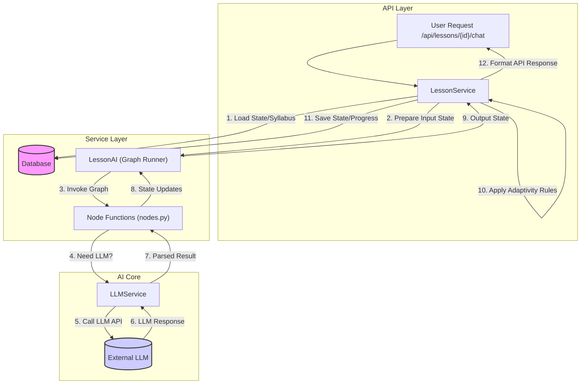

# Refactoring Plan: `lessons_graph.py`

## 1. Context and Goal

The current implementation in `backend/ai/lessons/lessons_graph.py` uses `langgraph` to manage the conversational flow for lessons. While functional, it has become complex and mixes several concerns. The goal of this refactoring is to improve modularity, testability, and better align the architecture with the adaptive learning requirements outlined in the `docs/PRD.md`.

## 2. Analysis of Current State

*   **`lessons_graph.py`:** Implements lesson conversation logic using `langgraph`, handling state (`LessonState`), nodes (greeting, routing, chat, exercise, quiz, evaluation), and direct LLM calls.
*   **`docs/PRD.md`:** Emphasizes key goals like adaptive learning (dynamic difficulty, personalized paths), bite-sized lessons (<5 min exposition + active learning), active learning (exercises/quizzes), and maintainability/scalability.

### Critique:

*   **Complexity/Monolith:** The `LessonAI` class (approx. 700 lines) is large and handles multiple responsibilities: graph definition, node logic implementation, LLM prompt formatting/calling, and state manipulation snippets. This hinders readability, testing, and maintenance.
*   **Limited Adaptivity:** While the graph handles different *modes* (chat, exercise, quiz), the core adaptivity described in the PRD (adjusting difficulty based on performance trends, suggesting prerequisites, modifying the syllabus) is not explicitly implemented within this graph structure. The current logic is more reactive (evaluating single answers) than adaptive (changing future flow based on patterns).
*   **Separation of Concerns:** The logic for *orchestrating* the overall lesson flow (including adaptivity rules, syllabus interaction, and database persistence) seems intended for a service layer (`LessonService`), but some lower-level logic (like prompt construction) currently resides directly within the graph nodes.
*   **Testability:** The tight coupling of graph structure, node logic, and direct LLM interactions within one class makes unit testing individual components difficult.

## 3. Proposed Refactoring Plan

To address the critique and better align with the PRD, the following architectural changes are proposed:

1.  **`LessonAI` (Graph Runner):** Refocus this class solely on defining the `langgraph` structure (nodes and edges). The actual *implementation* of the node logic will be moved out.
2.  **`nodes.py` (Node Logic):** Create a new module (e.g., `backend.ai.lessons.nodes`) containing standalone functions for each node's logic (e.g., `generate_chat_response`, `evaluate_answer`). These functions will take the `LessonState` and potentially other dependencies (like an LLM client) and return state updates.
3.  **`LLMService` / Enhanced `llm_utils.py`:** Consolidate all LLM interaction logic here – prompt loading/formatting, API calls, error handling, parsing/validation. The node functions will use this service, abstracting LLM details away from the core node logic.
4.  **`LessonService` (Orchestrator):** This existing or enhanced service layer class becomes the central point for managing a lesson session.
    *   Loads/persists `LessonState` from the database.
    *   Fetches syllabus and lesson content.
    *   Calls `LessonAI` to process conversational turns.
    *   **Crucially:** Implements the **adaptivity logic**. After a graph turn completes, the `LessonService` analyzes the updated state (e.g., `user_responses`) to decide on difficulty adjustments, suggest revisiting topics, or potentially flag syllabus modifications.
    *   Handles saving progress and managing transitions between lessons.

## 4. Visual Representation (Mermaid)

## 5. Role of LangGraph

LangGraph remains a suitable tool for managing the *turn-by-turn conversational state machine*. It provides:

*   Explicit state management (`LessonState`).
*   Clear visualization of the conversational flow within a turn.
*   Robust handling of conditional routing based on interaction mode and user intent.
*   Consistency with the LangChain ecosystem if used elsewhere.

The key distinction is that LangGraph manages the *state transitions within a single conversational turn*, while the `LessonService` manages the *overall lesson progression and adaptivity logic across multiple turns*.