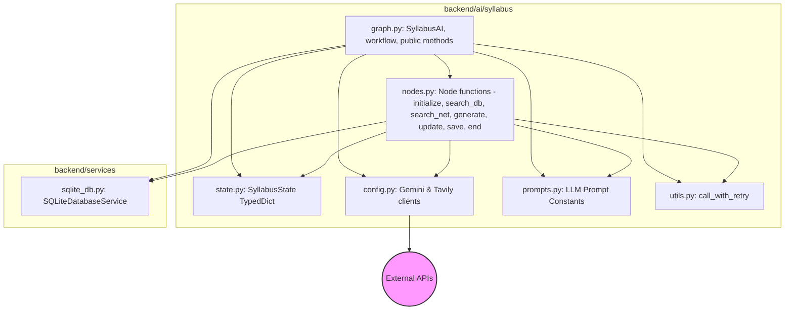

# Refactoring Plan for backend/ai/syllabus/syllabus_graph.py

This plan outlines the steps to refactor the large `syllabus_graph.py` file into smaller, more focused modules with terse, single-line docstrings where appropriate.

**1. New Files to Create:**

*   **`backend/ai/syllabus/config.py`**
    *   **Purpose:** Initialize and configure external API clients (Gemini, Tavily).
    *   **Content:** Code currently responsible for loading environment variables and setting up `genai` and `TavilyClient`.
    *   **Module Docstring:** `"""Configuration for syllabus generation external APIs."""`

*   **`backend/ai/syllabus/state.py`**
    *   **Purpose:** Define the data structure representing the state of the graph.
    *   **Content:** The `SyllabusState` TypedDict definition.
    *   **Module Docstring:** `"""Defines the state dictionary for the syllabus generation graph."""`

*   **`backend/ai/syllabus/prompts.py`**
    *   **Purpose:** Centralize the large multi-line prompt strings used for LLM interactions.
    *   **Content:** The prompt strings currently defined within `_generate_syllabus` and `_update_syllabus`, likely stored as constants.
    *   **Module Docstring:** `"""Stores prompt templates for syllabus generation and updates."""`

*   **`backend/ai/syllabus/utils.py`**
    *   **Purpose:** Contain reusable utility functions.
    *   **Content:** The `call_with_retry` function.
    *   **Module Docstring:** `"""Utility functions for the syllabus generation module."""`

*   **`backend/ai/syllabus/nodes.py`**
    *   **Purpose:** Implement the core logic for each individual node in the LangGraph workflow.
    *   **Content:** Functions derived from the existing private methods: `_initialize`, `_search_database`, `_search_internet`, `_generate_syllabus`, `_update_syllabus`, `_save_syllabus`, `_end`. These functions will be designed to accept the `state` dictionary and any necessary dependencies (like `db_service` or API clients) as arguments.
    *   **Module Docstring:** `"""Implements the node functions for the syllabus generation LangGraph."""`

**2. Refactor Existing File:**

*   **`backend/ai/syllabus/graph.py`** (The original file, significantly reduced)
    *   **Purpose:** Define the main `SyllabusAI` class, construct the LangGraph workflow, manage state transitions, and expose the public interface for interacting with the syllabus generation process.
    *   **Content:**
        *   The `SyllabusAI` class definition.
        *   `__init__` method to store dependencies like `db_service`.
        *   `_create_workflow` method, which will now import and use the node functions from `nodes.py` to build the graph.
        *   `_should_search_internet` conditional edge logic.
        *   The public methods (`initialize`, `get_or_create_syllabus`, `update_syllabus`, `save_syllabus`, `get_syllabus`, `delete_syllabus`, `clone_syllabus_for_user`) which will manage the agent's state and interact with the compiled graph or `db_service`.
        *   Necessary imports from the newly created modules (`config`, `state`, `prompts`, `utils`, `nodes`) and other dependencies like `langgraph` and `SQLiteDatabaseService`.
    *   **Module Docstring:** `"""Defines and manages the LangGraph workflow for syllabus generation."""`
    *   **Class Docstring:** `"""Orchestrates syllabus generation using a LangGraph workflow."""`

**Diagram of Proposed Structure:**

**Benefits of this Refactoring:**

*   **Modularity:** Each file handles a specific aspect (state, nodes, config, prompts, utils, graph orchestration).
*   **Readability:** Smaller files are easier to digest and understand.
*   **Maintainability:** Changes to prompts, API configurations, or specific node logic are isolated to their respective files.
*   **Testability:** Individual components (like utility functions or node logic) could potentially be tested more easily in isolation.