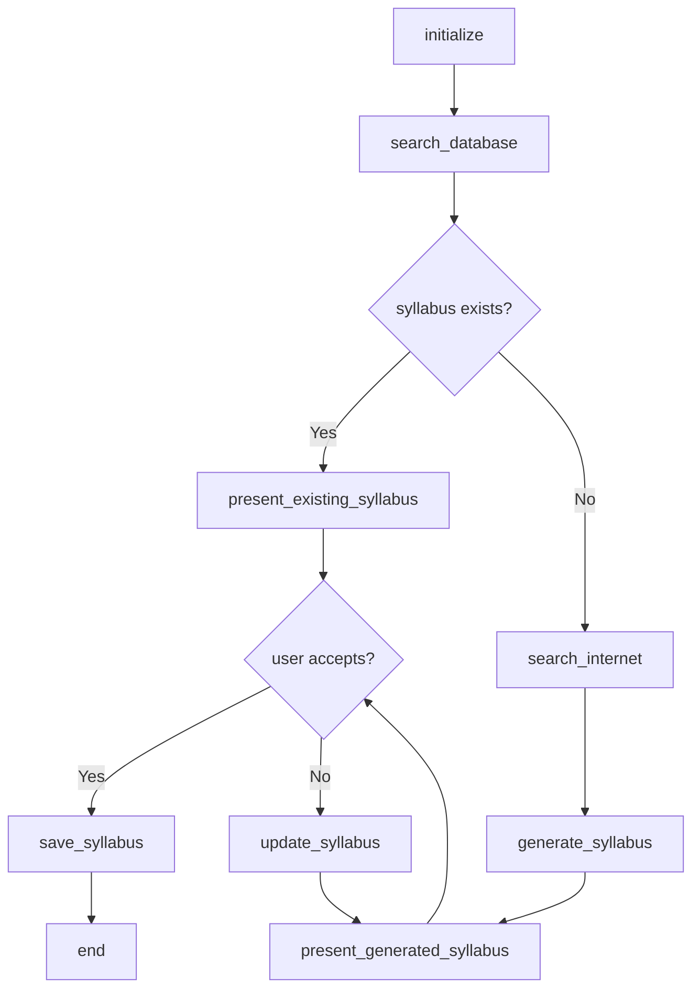
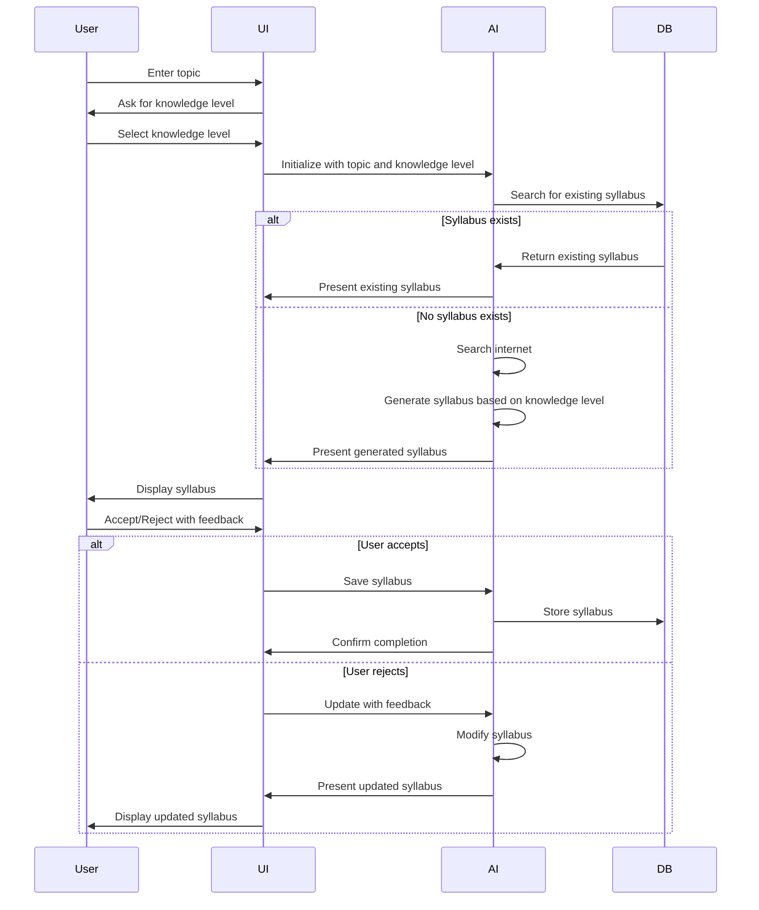

# Detailed Implementation Plan for Syllabus Feature (PRD Section 4.2)

Based on the requirements and clarifications, I'll create a detailed plan for implementing the syllabus feature. This feature will allow users to view existing syllabi or create new ones for topics that don't have syllabi yet, taking into account the user's knowledge level.

## 1. Project Structure

```
techtree/
├── .env                  # Environment variables
├── syllabus_db.json      # TinyDB database for storing syllabi
├── syllabus_demo.py      # Main script to run the demo
├── syllabus/             # Main folder for the syllabus feature
│   ├── ai/               # AI package
│   │   ├── __init__.py
│   │   └── langgraph_app.py  # LangGraph implementation
│   └── streamlit_app/    # UI package
│       ├── __init__.py
│       └── app.py        # Streamlit chat UI
```

## 2. Component Design

### 2.1 Database (TinyDB)

We'll use TinyDB to store syllabi at the top level. Each syllabus will be stored as a JSON document with the following structure (based on the example in the PRD):

```json
{
  "topic": "Introduction to Quantum Computing",
  "level": "Beginner",
  "duration": "4 weeks",
  "learning_objectives": [...],
  "modules": [
    {
      "week": 1,
      "title": "Introduction to Quantum Mechanics",
      "lessons": [...]
    },
    ...
  ]
}
```

### 2.2 AI Package (LangGraph)

The AI package will use LangGraph with Gemini 2.0 Pro to:

1. Search for existing syllabi in the database
2. Create new syllabi for topics that don't exist, tailored to the user's knowledge level
3. Update syllabi based on user feedback

#### State Definition

```python
class SyllabusState(TypedDict):
    topic: str
    user_knowledge_level: str  # 'beginner', 'early learner', 'good knowledge', or 'advanced'
    existing_syllabus: Optional[Dict]
    search_results: List[Dict]
    generated_syllabus: Optional[Dict]
    user_feedback: Optional[str]
    syllabus_accepted: bool
    iteration_count: int
```

#### Workflow Nodes

1. `initialize`: Initialize the state with the topic and user knowledge level
2. `search_database`: Search for existing syllabi in the database
3. `search_internet`: If no syllabus exists, search the internet for information
4. `generate_syllabus`: Generate a new syllabus based on search results and user knowledge level
5. `update_syllabus`: Update the syllabus based on user feedback
6. `save_syllabus`: Save the syllabus to the database
7. `end`: End the workflow

#### Workflow Graph



### 2.3 UI Package (Streamlit)

The UI package will use Streamlit chat to:

1. Allow users to enter a topic
2. Ask for the user's knowledge level (beginner, early learner, good knowledge, advanced)
3. Display existing or generated syllabi
4. Collect user feedback on syllabi
5. Show the final accepted syllabus

#### UI Flow



## 3. Implementation Details

### 3.1 TinyDB Setup

We'll create a TinyDB database at the top level to store syllabi:

```python
from tinydb import TinyDB, Query

# Initialize the database
db = TinyDB('syllabus_db.json')
syllabi_table = db.table('syllabi')

# Function to search for a syllabus by topic
def search_syllabus(topic):
    Syllabus = Query()
    return syllabi_table.search(Syllabus.topic == topic)

# Function to save a syllabus
def save_syllabus(syllabus):
    Syllabus = Query()
    # Check if syllabus already exists
    existing = syllabi_table.search(Syllabus.topic == syllabus['topic'])
    if existing:
        # Update existing syllabus
        syllabi_table.update(syllabus, Syllabus.topic == syllabus['topic'])
    else:
        # Insert new syllabus
        syllabi_table.insert(syllabus)
```

### 3.2 AI Package Implementation

The AI package will use LangGraph to create a workflow for syllabus generation and management:

```python
# Key functions in langgraph_app.py

def _initialize(self, topic: str, knowledge_level: str) -> Dict:
    """Initialize the state with the topic and user knowledge level."""
    # Validate knowledge level
    valid_levels = ['beginner', 'early learner', 'good knowledge', 'advanced']
    if knowledge_level not in valid_levels:
        knowledge_level = 'beginner'  # Default to beginner if invalid
        
    return {
        "topic": topic,
        "user_knowledge_level": knowledge_level,
        "existing_syllabus": None,
        "search_results": [],
        "generated_syllabus": None,
        "user_feedback": None,
        "syllabus_accepted": False,
        "iteration_count": 0,
    }

def _search_database(self, state: SyllabusState) -> Dict:
    """Search for existing syllabi in the database."""
    topic = state["topic"]
    existing = search_syllabus(topic)
    if existing:
        return {"existing_syllabus": existing[0]}
    return {}

def _search_internet(self, state: SyllabusState) -> Dict:
    """Search the internet for information about the topic."""
    topic = state["topic"]
    knowledge_level = state["user_knowledge_level"]
    
    # Use Tavily to search for information
    search_results = []
    try:
        # Search Wikipedia
        wiki_search = tavily.search(
            query=f"{topic} syllabus curriculum",
            search_depth="advanced",
            include_domains=["wikipedia.org", "edu"],
            max_results=2,
        )
        # Search other sources
        general_search = tavily.search(
            query=f"{topic} course syllabus curriculum for {knowledge_level}",
            search_depth="advanced",
            max_results=3,
        )
        search_results = [r.get("content", "") for r in wiki_search.get("results", [])]
        search_results.extend([r.get("content", "") for r in general_search.get("results", [])])
    except Exception as e:
        search_results = [f"Error searching for {topic}: {str(e)}"]
    
    return {"search_results": search_results}

def _generate_syllabus(self, state: SyllabusState) -> Dict:
    """Generate a syllabus based on search results and user knowledge level."""
    topic = state["topic"]
    knowledge_level = state["user_knowledge_level"]
    search_results = state["search_results"]
    
    # Combine search results into a single context
    search_context = "\n\n".join([f"Source {i+1}:\n{result}" for i, result in enumerate(search_results)])
    
    # Construct the prompt for Gemini
    prompt = f"""
    You are an expert curriculum designer creating a comprehensive syllabus for the topic: {topic}.
    
    The user's knowledge level is: {knowledge_level}
    
    Use the following information from internet searches to create an accurate and up-to-date syllabus:
    
    {search_context}
    
    Create a syllabus with the following structure:
    1. Topic name
    2. Level (should match or be appropriate for the user's knowledge level: {knowledge_level})
    3. Duration (e.g., "4 weeks")
    4. 3-5 Learning objectives
    5. Modules (organized by week or unit)
    6. Lessons within each module (5-10 lessons per module)
    
    Tailor the syllabus to the user's knowledge level:
    - For 'beginner': Focus on foundational concepts and gentle introduction
    - For 'early learner': Include basic concepts but move more quickly to intermediate topics
    - For 'good knowledge': Focus on intermediate to advanced topics, assuming basic knowledge
    - For 'advanced': Focus on advanced topics, cutting-edge developments, and specialized areas
    
    Format your response as a valid JSON object with the following structure:
    {{
      "topic": "Topic Name",
      "level": "Level",
      "duration": "Duration",
      "learning_objectives": ["Objective 1", "Objective 2", ...],
      "modules": [
        {{
          "week": 1,
          "title": "Module Title",
          "lessons": [
            {{ "title": "Lesson 1 Title" }},
            {{ "title": "Lesson 2 Title" }},
            ...
          ]
        }},
        ...
      ]
    }}
    
    Ensure the syllabus is comprehensive, well-structured, and follows a logical progression appropriate for the user's knowledge level.
    """
    
    response = call_with_retry(model.generate_content, prompt)
    response_text = response.text
    
    # Extract JSON from response
    import json
    import re
    
    # Find JSON pattern in the response
    json_pattern = r'```(?:json)?\s*({.*?})```'
    json_match = re.search(json_pattern, response_text, re.DOTALL)
    
    if json_match:
        json_str = json_match.group(1)
    else:
        # If no JSON block found, try to extract the entire JSON object
        json_str = response_text
    
    try:
        syllabus = json.loads(json_str)
        return {"generated_syllabus": syllabus}
    except json.JSONDecodeError:
        # If JSON parsing fails, return a basic structure
        return {
            "generated_syllabus": {
                "topic": topic,
                "level": knowledge_level.capitalize(),
                "duration": "4 weeks",
                "learning_objectives": ["Error parsing syllabus"],
                "modules": []
            }
        }

def _update_syllabus(self, state: SyllabusState) -> Dict:
    """Update the syllabus based on user feedback."""
    topic = state["topic"]
    knowledge_level = state["user_knowledge_level"]
    syllabus = state["generated_syllabus"] or state["existing_syllabus"]
    feedback = state["user_feedback"]
    
    # Construct the prompt for Gemini
    prompt = f"""
    You are an expert curriculum designer updating a syllabus for the topic: {topic}.
    
    The user's knowledge level is: {knowledge_level}
    
    Here is the current syllabus:
    {json.dumps(syllabus, indent=2)}
    
    The user has provided the following feedback:
    {feedback}
    
    Update the syllabus to address the user's feedback while ensuring it remains appropriate for their knowledge level ({knowledge_level}). Maintain the same JSON structure.
    
    Format your response as a valid JSON object with the following structure:
    {{
      "topic": "Topic Name",
      "level": "Level",
      "duration": "Duration",
      "learning_objectives": ["Objective 1", "Objective 2", ...],
      "modules": [
        {{
          "week": 1,
          "title": "Module Title",
          "lessons": [
            {{ "title": "Lesson 1 Title" }},
            {{ "title": "Lesson 2 Title" }},
            ...
          ]
        }},
        ...
      ]
    }}
    """
    
    response = call_with_retry(model.generate_content, prompt)
    response_text = response.text
    
    # Extract JSON from response (similar to _generate_syllabus)
    # ...
    
    return {
        "generated_syllabus": updated_syllabus,
        "iteration_count": state["iteration_count"] + 1
    }

def _save_syllabus(self, state: SyllabusState) -> Dict:
    """Save the syllabus to the database."""
    syllabus = state["generated_syllabus"] or state["existing_syllabus"]
    save_syllabus(syllabus)
    return {"syllabus_saved": True}

def _should_continue(self, state: SyllabusState) -> str:
    """Decide whether to continue or end the workflow."""
    if state["syllabus_accepted"]:
        return "save_syllabus"
    elif state["existing_syllabus"]:
        return "present_existing_syllabus"
    elif state["generated_syllabus"] and state["user_feedback"]:
        return "update_syllabus"
    elif state["generated_syllabus"]:
        return "present_generated_syllabus"
    elif state["search_results"]:
        return "generate_syllabus"
    else:
        return "search_internet"
```

### 3.3 UI Implementation

The Streamlit UI will provide a chat interface for interacting with the syllabus feature:

```python
# Key components in app.py

# Initialize session state
if "initialized" not in st.session_state:
    st.session_state.initialized = False
    st.session_state.messages = []
    st.session_state.syllabus_ai = SyllabusAI()
    st.session_state.topic = ""
    st.session_state.knowledge_level = ""
    st.session_state.syllabus = None
    st.session_state.syllabus_presented = False
    st.session_state.feedback_submitted = False
    st.session_state.syllabus_accepted = False
    st.session_state.initialized = True

# Topic selection
def handle_topic_submission():
    if st.session_state.topic_input:
        st.session_state.topic = st.session_state.topic_input
        st.session_state.messages.append({
            "role": "user",
            "content": f"I want to create a syllabus for {st.session_state.topic}"
        })
        st.session_state.messages.append({
            "role": "assistant",
            "content": f"Great! Let me know your knowledge level for {st.session_state.topic} so I can tailor the syllabus appropriately."
        })
        st.session_state.topic_input = ""
        st.session_state.topic_submitted = True

# Knowledge level selection
def handle_knowledge_level_selection():
    if st.session_state.knowledge_level_select:
        st.session_state.knowledge_level = st.session_state.knowledge_level_select
        st.session_state.messages.append({
            "role": "user",
            "content": f"My knowledge level is {st.session_state.knowledge_level}"
        })
        st.session_state.messages.append({
            "role": "assistant",
            "content": f"Thanks! Let me check if we already have a syllabus for {st.session_state.topic} at the {st.session_state.knowledge_level} level or create a new one for you."
        })
        st.session_state.knowledge_level_submitted = True

# Display syllabus
def display_syllabus(syllabus):
    st.subheader(f"Syllabus: {syllabus['topic']}")
    st.write(f"**Level:** {syllabus['level']}")
    st.write(f"**Duration:** {syllabus['duration']}")
    
    st.write("**Learning Objectives:**")
    for i, objective in enumerate(syllabus['learning_objectives'], 1):
        st.write(f"{i}. {objective}")
    
    st.write("**Modules:**")
    for module in syllabus['modules']:
        with st.expander(f"Week {module['week']}: {module['title']}"):
            for i, lesson in enumerate(module['lessons'], 1):
                st.write(f"{i}. {lesson['title']}")

# Handle feedback submission
def handle_feedback_submission():
    feedback = st.session_state.feedback_input
    if feedback:
        st.session_state.messages.append({
            "role": "user",
            "content": feedback
        })
        st.session_state.syllabus_ai.update_syllabus(feedback)
        st.session_state.feedback_submitted = True
        st.session_state.feedback_input = ""

# Handle syllabus acceptance
def handle_syllabus_acceptance():
    st.session_state.messages.append({
        "role": "user",
        "content": "I accept this syllabus."
    })
    st.session_state.messages.append({
        "role": "assistant",
        "content": "Great! I've saved this syllabus to the database."
    })
    st.session_state.syllabus_ai.save_syllabus()
    st.session_state.syllabus_accepted = True

# Main UI flow
if not st.session_state.topic:
    st.subheader("What topic would you like to create a syllabus for?")
    topic = st.text_input("Enter a topic", key="topic_input", on_change=handle_topic_submission)
elif not st.session_state.knowledge_level:
    st.subheader("What is your knowledge level for this topic?")
    knowledge_level = st.selectbox(
        "Select your knowledge level",
        options=["beginner", "early learner", "good knowledge", "advanced"],
        key="knowledge_level_select",
        on_change=handle_knowledge_level_selection
    )
elif not st.session_state.syllabus_presented:
    # Initialize AI with topic and knowledge level
    st.session_state.syllabus_ai.initialize(
        st.session_state.topic,
        st.session_state.knowledge_level
    )
    
    # Search for existing syllabus or create a new one
    syllabus = st.session_state.syllabus_ai.get_or_create_syllabus()
    st.session_state.syllabus = syllabus
    
    # Display the syllabus
    display_syllabus(syllabus)
    
    # Add message to chat
    st.session_state.messages.append({
        "role": "assistant",
        "content": f"Here's a syllabus for {st.session_state.topic} at the {st.session_state.knowledge_level} level. Would you like to accept it or provide feedback for improvements?"
    })
    
    st.session_state.syllabus_presented = True
```

### 3.4 Main Script (syllabus_demo.py)

The main script will tie everything together:

```python
#!/usr/bin/env python3
"""
Syllabus Demo for TechTree
"""

import os
import sys
from dotenv import load_dotenv

# Add the current directory to the path so we can import the syllabus package
sys.path.append(".")

# Load environment variables
load_dotenv()

# Import the syllabus packages
from syllabus.streamlit_app.app import run_app

if __name__ == "__main__":
    run_app()
```

## 4. Testing Strategy

1. **Unit Tests**:
   - Test database functions (search, save)
   - Test syllabus generation with mock search results
   - Test syllabus updating with mock feedback

2. **Integration Tests**:
   - Test the full workflow with mock user input
   - Test database integration

3. **Manual Testing**:
   - Test the UI with various topics and knowledge levels
   - Test feedback and iteration
   - Test with existing and new syllabi

## 5. Implementation Timeline

1. **Day 1**: Set up project structure and database
2. **Day 2**: Implement AI package (LangGraph)
3. **Day 3**: Implement UI package (Streamlit)
4. **Day 4**: Integrate components and test
5. **Day 5**: Refine and polish

## 6. Potential Challenges and Mitigations

1. **Challenge**: Gemini API might not always return valid JSON
   **Mitigation**: Implement robust JSON parsing with fallbacks

2. **Challenge**: Internet search might not return relevant results
   **Mitigation**: Use multiple search queries and sources

3. **Challenge**: User feedback might be vague or contradictory
   **Mitigation**: Implement clarification prompts in the UI

4. **Challenge**: Syllabus quality might vary based on knowledge level
   **Mitigation**: Implement quality checks and refinement steps

## 7. Future Enhancements

1. Implement semantic search for syllabi
2. Add user authentication for personalized syllabi
3. Integrate with lesson delivery system
4. Add analytics for syllabus usage and feedback
5. Implement syllabus versioning