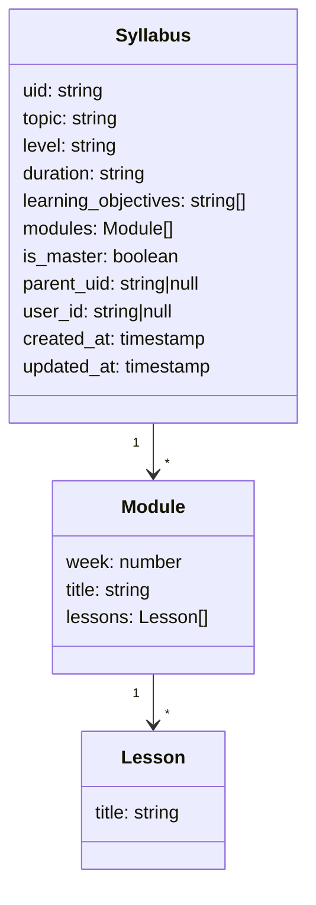

# Syllabus UID Implementation Plan

## Current System Analysis

The current system:
- Uses TinyDB to store syllabi in a JSON file (`syllabus_db.json`)
- Identifies syllabi by topic and knowledge level combination
- Allows users to provide feedback to improve syllabi before accepting them
- Does not have user authentication yet
- Does not track which user is viewing which syllabus

## Requirements

1. Add a UID to each syllabus
2. Maintain a master version of each syllabus
3. Track which user is viewing which syllabus version
4. Allow for future adaptive updates without affecting other users

## Implementation Plan

### 1. Database Schema Changes

We need to modify the syllabus database schema to include:



Key additions:
- `uid`: A unique identifier for each syllabus (UUID v4)
- `is_master`: Boolean flag to identify master versions
- `parent_uid`: Reference to the parent syllabus (if this is a user-specific version)
- `user_id`: The ID of the user this syllabus belongs to (null for master versions)
- `created_at` and `updated_at`: Timestamps for tracking changes

### 2. Code Changes

#### 2.1. Modify SyllabusAI Class

We need to update the SyllabusAI class to handle the new schema:

1. Update the `_initialize` method to include user_id parameter
2. Modify the `_search_database` method to search by user_id when provided
3. Update the `_save_syllabus` method to handle UIDs and master/user versions
4. Add methods for cloning a syllabus for a specific user

#### 2.2. Update Streamlit App

The Streamlit app needs to be updated to:

1. Accept a user_id parameter (or generate a temporary one)
2. Pass the user_id to the SyllabusAI methods
3. Display the syllabus version information to the user

### 3. Migration Strategy

We need to migrate existing syllabi to the new schema:

1. Create a migration script that:
   - Assigns UIDs to all existing syllabi
   - Marks them as master versions
   - Sets parent_uid to null
   - Sets user_id to null
   - Adds timestamps

### 4. Implementation Steps

1. **Update Database Schema**
   - Modify the SyllabusState TypedDict to include new fields
   - Update database queries to handle the new fields

2. **Add UID Generation**
   - Add a function to generate unique IDs (UUID v4)
   - Ensure UIDs are assigned when syllabi are created

3. **Implement Master/User Version Logic**
   - Add logic to create master versions by default
   - Add functionality to clone a syllabus for a specific user

4. **Update Search Logic**
   - Modify search to prioritize user-specific versions
   - Fall back to master versions when user-specific ones don't exist

5. **Migrate Existing Data**
   - Create a migration script to update existing syllabi

6. **Update Tests**
   - Modify tests to verify UID functionality
   - Add tests for user-specific syllabus retrieval

## Detailed Code Changes

### 1. Update SyllabusState TypedDict

```python
class SyllabusState(TypedDict):
    topic: str
    user_knowledge_level: str
    existing_syllabus: Optional[Dict]
    search_results: List[str]
    generated_syllabus: Optional[Dict]
    user_feedback: Optional[str]
    syllabus_accepted: bool
    iteration_count: int
    user_id: Optional[str]  # New field
```

### 2. Update _initialize Method

```python
def _initialize(
    self,
    _: Optional[SyllabusState] = None,
    topic: str = "",
    knowledge_level: str = "beginner",
    user_id: Optional[str] = None,  # New parameter
) -> Dict:
    """Initialize the state with the topic, user knowledge level, and user ID."""
    if not topic:
        raise ValueError("Topic is required")

    # Validate knowledge level
    valid_levels = ["beginner", "early learner", "good knowledge", "advanced"]
    if knowledge_level not in valid_levels:
        knowledge_level = "beginner"  # Default to beginner if invalid

    return {
        "topic": topic,
        "user_knowledge_level": knowledge_level,
        "existing_syllabus": None,
        "search_results": [],
        "generated_syllabus": None,
        "user_feedback": None,
        "syllabus_accepted": False,
        "iteration_count": 0,
        "user_entered_topic": topic,
        "user_id": user_id,  # New field
    }
```

### 3. Update _search_database Method

```python
def _search_database(self, state: SyllabusState) -> Dict:
    """Search for existing syllabi in the database."""
    topic = state["topic"]
    knowledge_level = state["user_knowledge_level"]
    user_id = state.get("user_id")

    # Search for match on topic, knowledge level, and user_id if provided
    syllabus_query = Query()
    
    if user_id:
        # First try to find a user-specific version
        user_specific = syllabi_table.search(
            ((syllabus_query.topic == topic) | (syllabus_query.user_entered_topic == topic))
            & (syllabus_query.level.test(lambda x: x.lower() == knowledge_level.lower()))
            & (syllabus_query.user_id == user_id)
        )
        
        if user_specific:
            return {"existing_syllabus": user_specific[0]}
    
    # If no user-specific version or no user_id provided, look for master version
    master_version = syllabi_table.search(
        ((syllabus_query.topic == topic) | (syllabus_query.user_entered_topic == topic))
        & (syllabus_query.level.test(lambda x: x.lower() == knowledge_level.lower()))
        & (syllabus_query.is_master == True)
    )
    
    if master_version:
        return {"existing_syllabus": master_version[0]}
    
    return {}
```

### 4. Update _save_syllabus Method

```python
def _save_syllabus(self, state: SyllabusState) -> Dict:
    """Save the syllabus to the database."""
    import uuid
    from datetime import datetime
    
    syllabus = state["generated_syllabus"] or state["existing_syllabus"]
    user_entered_topic = state["user_entered_topic"]
    user_id = state.get("user_id")
    
    if isinstance(syllabus, dict):
        # If syllabus is already a dict, use it directly
        syllabus["user_entered_topic"] = user_entered_topic
    else:
        # Convert syllabus (Document object) to a dict
        syllabus = syllabus.to_dict()
        syllabus["user_entered_topic"] = user_entered_topic
    
    # Add the user-entered topic to the syllabus
    syllabus["user_entered_topic"] = user_entered_topic
    
    # Check if syllabus already exists with same topic, level, and user_id
    syllabus_query = Query()
    
    if user_id:
        existing = syllabi_table.search(
            (syllabus_query.topic == syllabus["topic"])
            & (syllabus_query.level.test(
                lambda syllabus_doc: syllabus and syllabus_doc.lower() == syllabus["level"].lower() if syllabus_doc else False
            ))
            & (syllabus_query.user_id == user_id)
        )
    else:
        existing = syllabi_table.search(
            (syllabus_query.topic == syllabus["topic"])
            & (syllabus_query.level.test(
                lambda syllabus_doc: syllabus and syllabus_doc.lower() == syllabus["level"].lower() if syllabus_doc else False
            ))
            & (syllabus_query.is_master == True)
        )
    
    now = datetime.now().isoformat()
    
    if existing:
        # Update existing syllabus
        syllabus["updated_at"] = now
        
        if "uid" not in syllabus:
            # If somehow the existing syllabus doesn't have a UID, add one
            syllabus["uid"] = str(uuid.uuid4())
        
        if user_id:
            # If this is a user-specific version, ensure it has the correct user_id
            syllabus["user_id"] = user_id
            syllabus["is_master"] = False
            
            # If it doesn't have a parent_uid, try to find the master version
            if "parent_uid" not in syllabus:
                master = syllabi_table.search(
                    (syllabus_query.topic == syllabus["topic"])
                    & (syllabus_query.level.test(
                        lambda syllabus_doc: syllabus and syllabus_doc.lower() == syllabus["level"].lower() if syllabus_doc else False
                    ))
                    & (syllabus_query.is_master == True)
                )
                
                if master:
                    syllabus["parent_uid"] = master[0].get("uid")
        else:
            # If this is a master version, ensure it's marked as such
            syllabus["is_master"] = True
            syllabus["user_id"] = None
            syllabus["parent_uid"] = None
        
        # Update the syllabus in the database
        if user_id:
            syllabi_table.update(
                syllabus,
                (syllabus_query.topic == syllabus["topic"])
                & (syllabus_query.level.test(
                    lambda syllabus_doc: syllabus and syllabus_doc.lower() == syllabus["level"].lower() if syllabus_doc else False
                ))
                & (syllabus_query.user_id == user_id)
            )
        else:
            syllabi_table.update(
                syllabus,
                (syllabus_query.topic == syllabus["topic"])
                & (syllabus_query.level.test(
                    lambda syllabus_doc: syllabus and syllabus_doc.lower() == syllabus["level"].lower() if syllabus_doc else False
                ))
                & (syllabus_query.is_master == True)
            )
    else:
        # Insert new syllabus
        syllabus["uid"] = str(uuid.uuid4())
        syllabus["created_at"] = now
        syllabus["updated_at"] = now
        
        if user_id:
            # If this is a user-specific version
            syllabus["user_id"] = user_id
            syllabus["is_master"] = False
            
            # Try to find a master version to set as parent
            master = syllabi_table.search(
                (syllabus_query.topic == syllabus["topic"])
                & (syllabus_query.level.test(
                    lambda syllabus_doc: syllabus and syllabus_doc.lower() == syllabus["level"].lower() if syllabus_doc else False
                ))
                & (syllabus_query.is_master == True)
            )
            
            if master:
                syllabus["parent_uid"] = master[0].get("uid")
            else:
                # If no master exists, create one first
                master_syllabus = syllabus.copy()
                master_syllabus["uid"] = str(uuid.uuid4())
                master_syllabus["is_master"] = True
                master_syllabus["user_id"] = None
                master_syllabus["parent_uid"] = None
                
                syllabi_table.insert(master_syllabus)
                
                # Set the parent_uid for the user-specific version
                syllabus["parent_uid"] = master_syllabus["uid"]
        else:
            # If this is a master version
            syllabus["is_master"] = True
            syllabus["user_id"] = None
            syllabus["parent_uid"] = None
        
        syllabi_table.insert(syllabus)
    
    return {"syllabus_saved": True}
```

### 5. Add clone_syllabus Method

```python
def clone_syllabus_for_user(self, user_id: str) -> Dict:
    """Clone the current syllabus for a specific user."""
    if not self.state:
        raise ValueError("Agent not initialized")
    
    syllabus = self.state["generated_syllabus"] or self.state["existing_syllabus"]
    
    if not syllabus:
        raise ValueError("No syllabus to clone")
    
    # Create a copy of the syllabus
    import copy
    import uuid
    from datetime import datetime
    
    user_syllabus = copy.deepcopy(syllabus)
    
    # Update the copy with user-specific information
    user_syllabus["uid"] = str(uuid.uuid4())
    user_syllabus["user_id"] = user_id
    user_syllabus["is_master"] = False
    user_syllabus["created_at"] = datetime.now().isoformat()
    user_syllabus["updated_at"] = datetime.now().isoformat()
    
    # If the source is a master version, set it as the parent
    if syllabus.get("is_master", False):
        user_syllabus["parent_uid"] = syllabus.get("uid")
    else:
        # If the source is already a user version, keep its parent
        user_syllabus["parent_uid"] = syllabus.get("parent_uid")
    
    # Save the user-specific syllabus
    syllabi_table.insert(user_syllabus)
    
    # Update the state
    self.state["generated_syllabus"] = user_syllabus
    
    return user_syllabus
```

### 6. Update initialize Method

```python
def initialize(self, topic: str, knowledge_level: str, user_id: Optional[str] = None) -> Dict:
    """Initialize the agent with a topic, knowledge level, and optional user ID."""
    self.state = self._initialize(topic=topic, knowledge_level=knowledge_level, user_id=user_id)
    return {
        "status": "initialized",
        "topic": topic,
        "knowledge_level": knowledge_level,
        "user_id": user_id,
    }
```

### 7. Migration Script

```python
#!/usr/bin/env python3
"""
Migration script to add UIDs to existing syllabi in the database.
This script:
1. Adds a unique ID (UUID) to each syllabus
2. Marks all existing syllabi as master versions
3. Sets parent_uid to null
4. Sets user_id to null
5. Adds created_at and updated_at timestamps
"""

import uuid
from datetime import datetime
import sys
from tinydb import TinyDB, Query

# Add the current directory to the path
sys.path.append(".")

def migrate_syllabi_to_uid_system():
    """Migrate existing syllabi to the new UID system."""
    print("Starting migration of syllabi to UID system...")
    
    # Open the database
    db = TinyDB("syllabus_db.json")
    syllabi_table = db.table("syllabi")
    
    # Get all existing syllabi
    all_syllabi = syllabi_table.all()
    print(f"Found {len(all_syllabi)} syllabi to migrate.")
    
    now = datetime.now().isoformat()
    migrated_count = 0
    
    # Update each syllabus
    for syllabus in all_syllabi:
        doc_id = syllabus.doc_id
        
        # Add UID if not present
        if "uid" not in syllabus:
            syllabus["uid"] = str(uuid.uuid4())
        
        # Mark as master version
        syllabus["is_master"] = True
        
        # Set user_id to None
        syllabus["user_id"] = None
        
        # Set parent_uid to None
        syllabus["parent_uid"] = None
        
        # Add timestamps
        if "created_at" not in syllabus:
            syllabus["created_at"] = now
        
        if "updated_at" not in syllabus:
            syllabus["updated_at"] = now
        
        # Update the syllabus in the database
        syllabi_table.update(syllabus, doc_ids=[doc_id])
        migrated_count += 1
    
    print(f"Migration complete. Updated {migrated_count} syllabi.")
    
    # Verify migration
    all_syllabi_after = syllabi_table.all()
    verified_count = 0
    
    for syllabus in all_syllabi_after:
        if (
            "uid" in syllabus
            and "is_master" in syllabus
            and "user_id" in syllabus
            and "parent_uid" in syllabus
            and "created_at" in syllabus
            and "updated_at" in syllabus
        ):
            verified_count += 1
    
    print(f"Verification complete. {verified_count}/{len(all_syllabi_after)} syllabi have all required fields.")

if __name__ == "__main__":
    migrate_syllabi_to_uid_system()
```

## Testing Strategy

1. **Unit Tests**
   - Test UID generation
   - Test master/user version logic
   - Test syllabus cloning

2. **Integration Tests**
   - Test the full workflow with user IDs
   - Test retrieving user-specific syllabi
   - Test fallback to master versions

3. **Migration Test**
   - Test the migration script on a copy of the production database

## Future Considerations

1. **User Authentication System**
   - When implemented, integrate with the syllabus UID system
   - Use real user IDs instead of temporary ones

2. **Adaptive Updates**
   - Implement logic to update syllabi based on user behavior
   - Track which parts of the syllabus are viewed/completed

3. **Version History**
   - Add functionality to track the history of changes to syllabi
   - Allow reverting to previous versions

4. **Sharing and Collaboration**
   - Allow users to share their customized syllabi
   - Implement collaborative editing features

## Streamlit App Updates

To support the UID system in the Streamlit app, we'll need to make the following changes:

```python
# In run_app() function, update the session state initialization
if "initialized" not in st.session_state:
    st.session_state.initialized = False
    st.session_state.messages = []
    st.session_state.syllabus_ai = SyllabusAI()
    st.session_state.topic = ""
    st.session_state.knowledge_level = ""
    st.session_state.syllabus = None
    st.session_state.syllabus_presented = False
    st.session_state.feedback_submitted = False
    st.session_state.syllabus_accepted = False
    st.session_state.topic_submitted = False
    st.session_state.knowledge_level_submitted = False
    st.session_state.user_id = str(uuid.uuid4())  # Generate a temporary user ID
    st.session_state.initialized = True

# When initializing the SyllabusAI, pass the user_id
st.session_state.syllabus_ai.initialize(
    st.session_state.topic, 
    st.session_state.knowledge_level,
    st.session_state.user_id  # Pass the user ID
)

# When displaying the syllabus, show version information
def display_syllabus(syllabus):
    """Display the syllabus."""
    st.subheader(f"Syllabus: {syllabus['topic']}")
    st.write(f"**Level:** {syllabus['level']}")
    st.write(f"**Duration:** {syllabus['duration']}")
    
    # Display version information
    if syllabus.get("is_master", False):
        st.write("**Version:** Master")
    else:
        st.write("**Version:** User-specific")
        if syllabus.get("parent_uid"):
            st.write(f"**Based on:** Master version")
    
    st.write("**Learning Objectives:**")
    for i, objective in enumerate(syllabus["learning_objectives"], 1):
        st.write(f"{i}. {objective}")
    
    st.write("**Modules:**")
    for module in syllabus["modules"]:
        with st.expander(f"Week {module['week']}: {module['title']}"):
            for i, lesson in enumerate(module["lessons"], 1):
                st.write(f"{i}. {lesson['title']}")
```

## Implementation Timeline

1. **Week 1: Database Schema Updates and Migration**
   - Update SyllabusState TypedDict
   - Create and test migration script
   - Run migration on production database

2. **Week 2: Core Functionality**
   - Update _initialize, _search_database, and _save_syllabus methods
   - Add clone_syllabus_for_user method
   - Update initialize method

3. **Week 3: Streamlit App Updates**
   - Update session state to include user_id
   - Modify syllabus display to show version information
   - Update syllabus creation and retrieval flow

4. **Week 4: Testing and Refinement**
   - Write unit tests for new functionality
   - Perform integration testing
   - Fix bugs and refine implementation