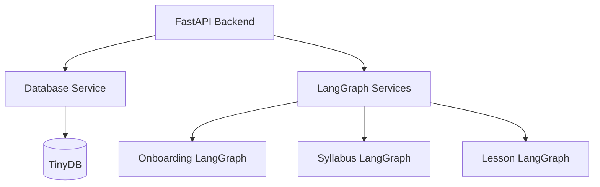
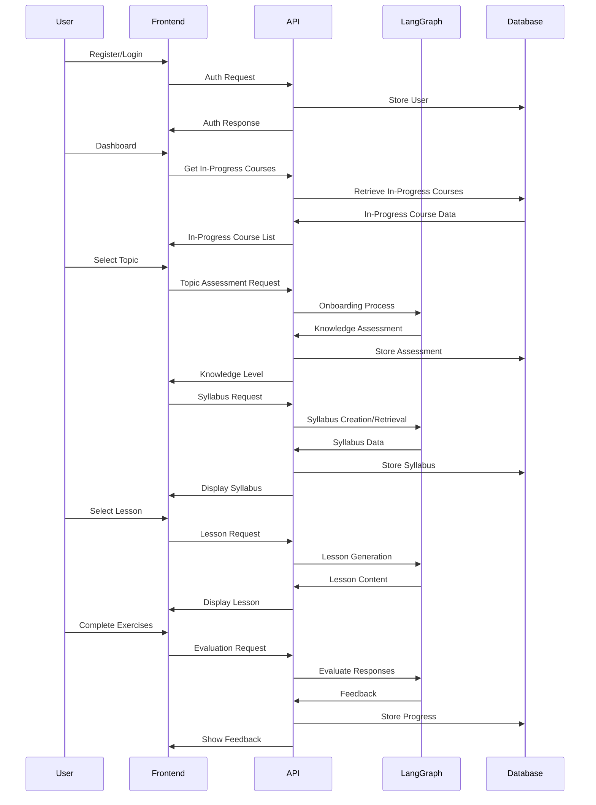

Complete Implementation Plan for Unified TechTree App
1. Overall Architecture
The unified TechTree application will follow a client-server architecture:

Backend Structure:

Frontend Structure:

The frontend is built using Flask, serving HTML templates and static assets (CSS, JavaScript, images).  It interacts with the FastAPI backend via API calls.

Data Flow:

The application will maintain the separation between the three core LangGraph components (Onboarding, Syllabus, Lesson) while providing a unified experience through:

A consistent UI design language
Seamless transitions between components
Unified API layer
2. Backend Implementation
2.1 FastAPI Service
Create a FastAPI application that integrates the existing LangGraph components:

# backend/main.py
from fastapi import FastAPI, Depends, HTTPException
from fastapi.middleware.cors import CORSMiddleware

app = FastAPI(title="TechTree API")

# Add CORS middleware to allow frontend requests
# Adjust allow_origins as needed for your Flask setup
app.add_middleware(
    CORSMiddleware,
    allow_origins=["http://localhost:5000", "http://127.0.0.1:5000"],
    allow_credentials=True,
    allow_methods=["*"],
    allow_headers=["*"],
)

# Include routers for each component
app.include_router(auth_router, prefix="/auth", tags=["Authentication"])
app.include_router(onboarding_router, prefix="/onboarding", tags=["Onboarding"])
app.include_router(syllabus_router, prefix="/syllabus", tags=["Syllabus"])
app.include_router(lesson_router, prefix="/lesson", tags=["Lesson"])
app.include_router(progress_router, prefix="/progress", tags=["User Progress"])
2.2 Database Service
The database service will implement the model we discussed:

# backend/services/db.py
from tinydb import TinyDB, Query
import uuid
from datetime import datetime

class DatabaseService:
    def __init__(self, db_path="techtree_db.json"):
        self.db = TinyDB(db_path)
        self.users = self.db.table("users")
        self.assessments = self.db.table("user_assessments")
        self.syllabi = self.db.table("syllabi")
        self.lesson_content = self.db.table("lesson_content")
        self.user_progress = self.db.table("user_progress")

    # User methods
    def create_user(self, email, password_hash, name=None):
        user_id = str(uuid.uuid4())
        now = datetime.now().isoformat()

        user = {
            "user_id": user_id,
            "email": email,
            "name": name or email.split("@")[0],
            "password_hash": password_hash,
            "created_at": now,
            "updated_at": now
        }

        self.users.insert(user)
        return user_id

    # Assessment methods
    def save_assessment(self, user_id, topic, knowledge_level, score, questions, responses):
        assessment_id = str(uuid.uuid4())
        now = datetime.now().isoformat()

        assessment = {
            "assessment_id": assessment_id,
            "user_id": user_id,
            "topic": topic,
            "knowledge_level": knowledge_level,
            "score": score,
            "question_history": questions,
            "response_history": responses,
            "created_at": now
        }

        self.assessments.insert(assessment)
        return assessment_id

    # Syllabus methods - Already implemented: get_syllabus, get_syllabus_by_id, save_syllabus

    # Additional methods for each entity and operation
2.3 LangGraph Integration
Wrap each LangGraph component with a service class:

# backend/services/onboarding_service.py
from onboarding.ai.langgraph_app import TechTreeAI
from services.db import DatabaseService

class OnboardingService:
    def __init__(self, db_service=None):
        self.tech_tree_ai = TechTreeAI()
        self.db_service = db_service or DatabaseService()

    async def start_assessment(self, topic, user_id=None):
        """Initialize the assessment process"""
        self.tech_tree_ai.initialize(topic)
        result = self.tech_tree_ai.perform_search()

        # First question
        question_result = self.tech_tree_ai.generate_question()

        return {
            "search_status": result["search_status"],
            "question": question_result["question"],
            "difficulty": question_result["difficulty_str"]
        }

    # Additional methods for assessment process
3. Frontend Implementation
The frontend is implemented using Flask.  It serves HTML templates and interacts with the FastAPI backend.

3.1. Key UI Components

Dashboard - In Progress Courses

After successful login, the Dashboard will display a list of the user's in-progress courses. Each entry will show:

- The course topic
- Progress (e.g., percentage of completed lessons, modules completed/total modules)
- A button/link to continue the course

Users will also have an option to start a new course.
Onboarding Assessment Component

The onboarding assessment is rendered using HTML templates and JavaScript to handle user interaction.  It communicates with the FastAPI backend to submit answers and receive feedback.

3.2 User Flow Through the Application
The app will guide users through a clear flow:

Login/Registration → The entry point to the application
Dashboard → Shows user progress, available topics, and in-progress courses
Onboarding Assessment → Evaluates user's knowledge of a selected topic
Syllabus Creation/Review → Presents a customized syllabus based on the assessment
Lesson Delivery → Interactive lessons from the syllabus with activities and assessments
Progress Tracking → Visual feedback on completion and performance
4. Implementation Plan and Timeline
Phase 1: Foundation (Weeks 1-2)
Set up the FastAPI backend with core routes
Implement the database service and initial schema
Create wrapper services for LangGraph components
Set up the Flask frontend, serving basic HTML templates
Phase 2: Core Functionality (Weeks 3-4)
Implement user authentication (using Flask routes and backend API)
Build the onboarding assessment flow (templates and API interaction)
Develop the syllabus creation/customization interface (templates and API)
Create the lesson delivery component (templates and API)
Phase 3: Integration and Refinement (Weeks 5-6)
Connect all components through the unified API
Implement progress tracking and visualization (using template rendering)
Add responsive design for mobile devices
Polish the UI/UX with consistent styling
Phase 4: Testing and Deployment (Weeks 7-8)
Comprehensive testing across components
Performance optimization
Documentation
Deployment preparation and execution
5. Key Technical Considerations
Authentication
JWT-based authentication for API security (FastAPI)
Secure password hashing with bcrypt
Session management in Flask
API Communication
Use `requests` library in Flask to interact with the FastAPI backend
Efficient error handling and retry mechanisms for LLM API calls
Performance
Database caching for expensive LLM-generated content
Pagination for large datasets (e.g., user progress history)
This comprehensive plan provides a clear path to implementing the unified TechTree application with Flask for the frontend and FastAPI for the backend, integrating the existing LangGraph components while providing a seamless user experience through a well-organized UI and database structure.