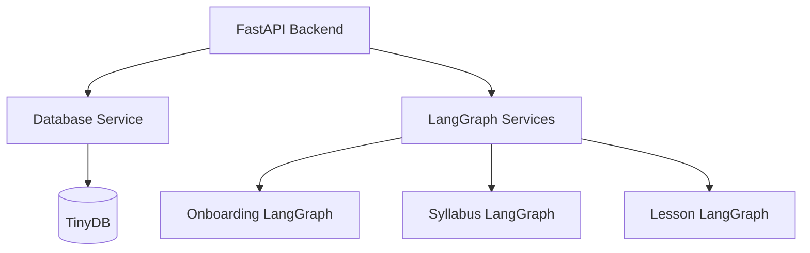
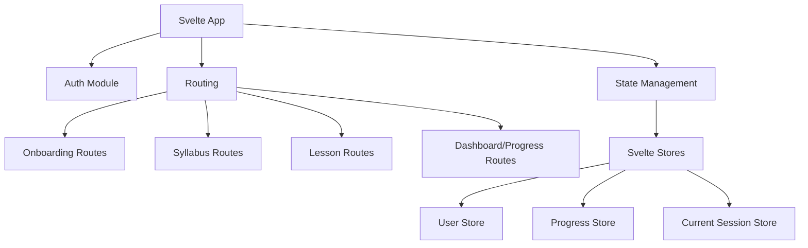
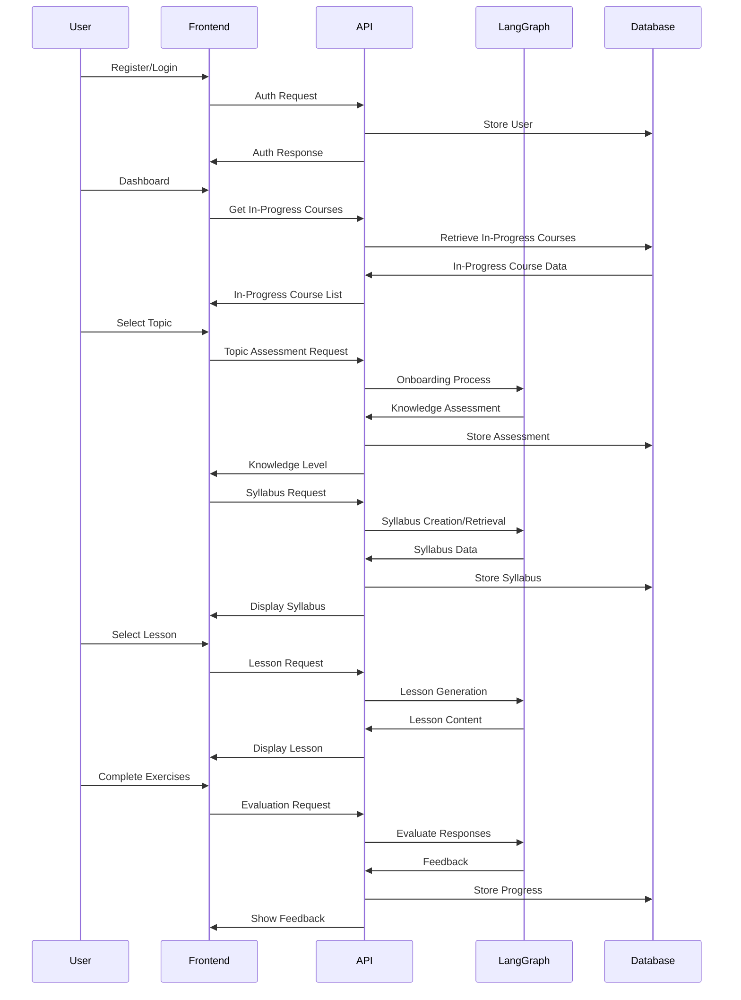

Complete Implementation Plan for Unified TechTree Svelte App
1. Overall Architecture
The unified TechTree application will follow a modern web architecture pattern:

Backend Structure:

Frontend Structure:

Data Flow:

The application will maintain the separation between the three core LangGraph components (Onboarding, Syllabus, Lesson) while providing a unified experience through:

A consistent UI design language
Seamless transitions between components
Centralized state management
Unified API layer
2. Backend Implementation
2.1 FastAPI Service
Create a FastAPI application that integrates the existing LangGraph components:

# backend/main.py
from fastapi import FastAPI, Depends, HTTPException
from fastapi.middleware.cors import CORSMiddleware

app = FastAPI(title="TechTree API")

# Add CORS middleware to allow frontend requests
app.add_middleware(
    CORSMiddleware,
    allow_origins=["http://localhost:5000"],  # Svelte dev server
    allow_credentials=True,
    allow_methods=["*"],
    allow_headers=["*"],
)

# Include routers for each component
app.include_router(auth_router, prefix="/auth", tags=["Authentication"])
app.include_router(onboarding_router, prefix="/onboarding", tags=["Onboarding"])
app.include_router(syllabus_router, prefix="/syllabus", tags=["Syllabus"])
app.include_router(lesson_router, prefix="/lesson", tags=["Lesson"])
app.include_router(progress_router, prefix="/progress", tags=["User Progress"])
2.2 Database Service
The database service will implement the model we discussed:

# backend/services/db.py
from tinydb import TinyDB, Query
import uuid
from datetime import datetime

class DatabaseService:
    def __init__(self, db_path="techtree_db.json"):
        self.db = TinyDB(db_path)
        self.users = self.db.table("users")
        self.assessments = self.db.table("user_assessments")
        self.syllabi = self.db.table("syllabi")
        self.lesson_content = self.db.table("lesson_content")
        self.user_progress = self.db.table("user_progress")

    # User methods
    def create_user(self, email, password_hash, name=None):
        user_id = str(uuid.uuid4())
        now = datetime.now().isoformat()

        user = {
            "user_id": user_id,
            "email": email,
            "name": name or email.split("@")[0],
            "password_hash": password_hash,
            "created_at": now,
            "updated_at": now
        }

        self.users.insert(user)
        return user_id

    # Assessment methods
    def save_assessment(self, user_id, topic, knowledge_level, score, questions, responses):
        assessment_id = str(uuid.uuid4())
        now = datetime.now().isoformat()

        assessment = {
            "assessment_id": assessment_id,
            "user_id": user_id,
            "topic": topic,
            "knowledge_level": knowledge_level,
            "score": score,
            "question_history": questions,
            "response_history": responses,
            "created_at": now
        }

        self.assessments.insert(assessment)
        return assessment_id

    # Syllabus methods - Already implemented: get_syllabus, get_syllabus_by_id, save_syllabus

    # Additional methods for each entity and operation
2.3 LangGraph Integration
Wrap each LangGraph component with a service class:

# backend/services/onboarding_service.py
from onboarding.ai.langgraph_app import TechTreeAI
from services.db import DatabaseService

class OnboardingService:
    def __init__(self, db_service=None):
        self.tech_tree_ai = TechTreeAI()
        self.db_service = db_service or DatabaseService()

    async def start_assessment(self, topic, user_id=None):
        """Initialize the assessment process"""
        self.tech_tree_ai.initialize(topic)
        result = self.tech_tree_ai.perform_search()

        # First question
        question_result = self.tech_tree_ai.generate_question()

        return {
            "search_status": result["search_status"],
            "question": question_result["question"],
            "difficulty": question_result["difficulty_str"]
        }

    # Additional methods for assessment process
3. Frontend Implementation
3.1 Project Setup
Initialize the Svelte project and configure the basic structure:

npx degit sveltejs/template techtree-frontend
cd techtree-frontend

# Install additional dependencies
npm install svelte-routing
npm install svelte-store
npm install axios
npm install svelte-material-ui
3.2 Main Application Structure
<!-- src/App.svelte -->

<Router>
  <Header on:toggleSidebar={() => sidebarOpen = !sidebarOpen} />

  <main class="content">
    <Sidebar open={sidebarOpen} />

    

      <Route path="/" component={Dashboard} />
      <Route path="/onboard/:topic?" component={Onboarding} />
      <Route path="/syllabus/:topic/:level?" component={Syllabus} />
      <Route path="/lesson/:syllabusId/:module/:lesson" component={Lesson} />
    

  </main>

  <Footer />
</Router>

3.3 State Management
Implement Svelte stores for centralized state management:

// src/stores/user.js
import { writable } from "svelte/store";

// User authentication and profile
export const user = writable({
  userId: null,
  email: null,
  name: null,
  isAuthenticated: false
});

// Current session context
export const sessionContext = writable({
  currentTopic: null,
  currentLevel: null,
  currentSyllabusId: null,
  currentModuleTitle: null,
  currentLessonTitle: null
});

// Progress tracking
export const userProgress = writable({
  topics: {},
  completedLessons: [],
  assessmentResults: {}
});

// Message history for chat-like interfaces
export const messageHistory = writable([]);
3.4 API Service
Create a service to communicate with the backend:

// src/services/api.js
import axios from "axios";

const API_URL = import.meta.env.VITE_API_URL || "http://localhost:8000";

const api = axios.create({
  baseURL: API_URL,
  timeout: 30000,
  headers: {
    "Content-Type": "application/json"
  }
});

// Authentication endpoints
export const auth = {
  login: async (email, password) => {
    const response = await api.post("/auth/login", { email, password });
    return response.data;
  },
  register: async (email, password, name) => {
    const response = await api.post("/auth/register", { email, password, name });
    return response.data;
  },
  logout: async () => {
    const response = await api.post("/auth/logout");
    return response.data;
  }
};

// Onboarding endpoints
export const onboarding = {
  startAssessment: async (topic) => {
    const response = await api.post("/onboarding/assessment", { topic });
    return response.data;
  },
  submitAnswer: async (answer) => {
    const response = await api.post("/onboarding/answer", { answer });
    return response.data;
  },
  getResult: async () => {
    const response = await api.get("/onboarding/result");
    return response.data;
  }
};

// Additional endpoints for syllabus and lesson components
3.5 Key UI Components

Dashboard - In Progress Courses
<!-- src/routes/Dashboard.svelte -->
After successful login, the Dashboard will display a list of the user's in-progress courses.  Each entry will show:

- The course topic
- Progress (e.g., percentage of completed lessons, modules completed/total modules)
- A button/link to continue the course

Users will also have an option to start a new course.
Onboarding Assessment Component
<!-- src/routes/Onboarding.svelte -->

<!-- Template for the onboarding UI -->

  <h1>Knowledge Assessment: {topic}</h1>

  

    {#each $messageHistory as message}
      <ChatMessage {message} />
    {/each}
  

  {#if isLoading}
    <LoadingIndicator />
  {:else if !topic}
    

      <h2>What topic would you like to learn about?</h2>
      <input
        bind:value={topic}
        placeholder="Enter a topic (e.g., 'Quantum Physics')"
      />
      <button on:click={() => onMount()}>Start Assessment</button>
    

  {:else if !assessmentComplete}
    

      <textarea
        bind:value={userAnswer}
        placeholder="Type your answer here..."
        rows="3"
      ></textarea>
      <button on:click={handleSubmitAnswer}>Submit</button>
    

  {:else}
    

      <h2>Assessment Complete!</h2>
      
Knowledge level: <strong>{assessmentResult.knowledge_level}</strong>

      
Redirecting to your personalized syllabus...

    

  {/if}

3.6 User Flow Through the Application
The app will guide users through a clear flow:

Login/Registration → The entry point to the application
Dashboard → Shows user progress, available topics, and in-progress courses
Onboarding Assessment → Evaluates user's knowledge of a selected topic
Syllabus Creation/Review → Presents a customized syllabus based on the assessment
Lesson Delivery → Interactive lessons from the syllabus with activities and assessments
Progress Tracking → Visual feedback on completion and performance
4. Implementation Plan and Timeline
Phase 1: Foundation (Weeks 1-2)
Set up the FastAPI backend with core routes
Implement the database service and initial schema
Create wrapper services for LangGraph components
Set up the Svelte frontend project with routing and basic components
Phase 2: Core Functionality (Weeks 3-4)
Implement user authentication
Build the onboarding assessment flow
Develop the syllabus creation/customization interface
Create the lesson delivery component
Phase 3: Integration and Refinement (Weeks 5-6)
Connect all components through the unified API
Implement progress tracking and visualization
Add responsive design for mobile devices
Polish the UI/UX with consistent styling
Phase 4: Testing and Deployment (Weeks 7-8)
Comprehensive testing across components
Performance optimization
Documentation
Deployment preparation and execution
5. Key Technical Considerations
Authentication
JWT-based authentication for API security
Secure password hashing with bcrypt
Local storage for persistent login state
API Communication
Axios for HTTP requests with interceptors for token management
Efficient error handling and retry mechanisms for LLM API calls
Streaming responses where appropriate for real-time updates
State Management
Svelte stores for reactive state
Clear separation of UI state vs. application state
Persistence for critical user data
Performance
Lazy loading of components and routes
Database caching for expensive LLM-generated content
Pagination for large datasets (e.g., user progress history)
This comprehensive plan provides a clear path to implementing the unified TechTree application with Svelte, integrating the existing LangGraph components while providing a seamless user experience through a well-organized UI and database structure.