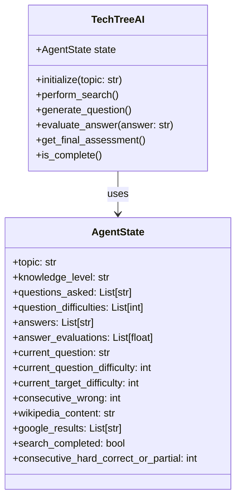
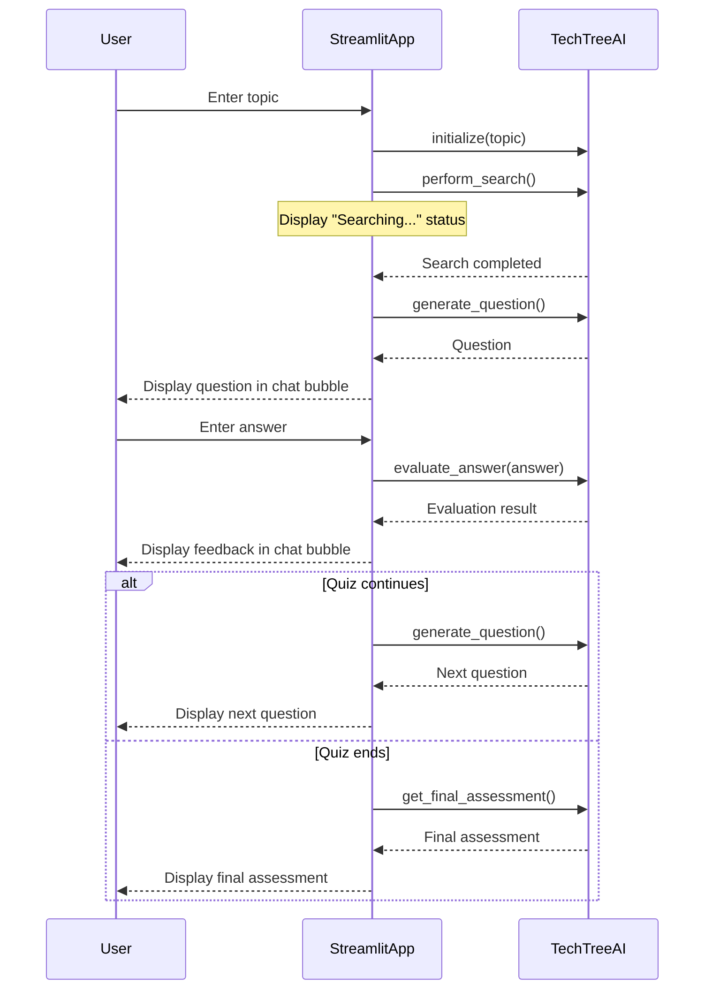

# Detailed Plan: Converting CLI Tech Tree to Streamlit Chat App

## Overview

We'll convert the existing CLI-based Tech Tree demo to a Streamlit application with a chat-based interface. The plan involves:

1. Creating a new AI module that encapsulates the langgraph app from demo.py
2. Developing a Streamlit app that calls this AI module
3. Maintaining all existing functionality while simplifying the user experience

## Project Structure

```
techtree/
├── demo.py                  # Original CLI implementation (unchanged)
├── ai/
│   ├── __init__.py          # Makes the directory a package
│   └── langgraph_app.py     # New encapsulated langgraph app
├── streamlit_app/
│   ├── __init__.py          # Makes the directory a package
│   └── app.py               # Streamlit chat interface
└── pyproject.toml           # Project dependencies (already includes streamlit)
```

## Component Design

### 1. AI Module (`ai/langgraph_app.py`)

This module will:
- Encapsulate the langgraph app from demo.py
- Remove the CLI-specific code (like input() calls)
- Expose a clean API for the Streamlit app to use
- Accept the topic from the Streamlit app instead of asking for it
- Return structured responses that the Streamlit app can display



### 2. Streamlit App (`streamlit_app/app.py`)

This app will:
- Provide a simple chat interface
- Handle the initial topic selection
- Pass user inputs to the AI module
- Display responses from the AI module in chat bubbles
- Show system status updates as text (not in chat bubbles)
- Manage the conversation flow



## Implementation Details

### 1. AI Module (`ai/langgraph_app.py`)

The AI module will:
- Import necessary components from demo.py
- Remove CLI-specific code
- Create a class-based API for the Streamlit app
- Maintain the langgraph workflow but adapt it for programmatic use
- Provide methods to:
  - Initialize with a topic
  - Perform internet search
  - Generate questions
  - Evaluate answers
  - Get final assessment
  - Check if the quiz is complete

### 2. Streamlit App (`streamlit_app/app.py`)

The Streamlit app will:
- Use `st.chat_message()` for chat bubbles
- Use `st.text()` or `st.write()` for system status updates
- Maintain session state to track conversation history and AI state
- Handle the conversation flow:
  1. Initial topic selection
  2. Internet search status
  3. Question presentation
  4. Answer input
  5. Feedback display
  6. Final assessment

## Key Challenges and Solutions

1. **State Management**: 
   - Use Streamlit's session state to maintain conversation history and AI state between interactions
   - Store the TechTreeAI instance in session state

2. **Asynchronous Operations**:
   - Handle potentially slow operations (like internet search) with appropriate status indicators
   - Use Streamlit's rerun mechanism to update the UI when operations complete

3. **Conversation Flow**:
   - Implement a state machine in the Streamlit app to track the current stage of the conversation
   - Use conditional rendering to show appropriate UI elements based on the current state

4. **Error Handling**:
   - Implement robust error handling for API failures
   - Provide clear error messages to the user
   - Allow for retrying failed operations

## Testing Strategy

1. **Unit Testing**:
   - Test the AI module independently of the Streamlit app
   - Verify that it produces the expected outputs for given inputs

2. **Integration Testing**:
   - Test the Streamlit app with the AI module
   - Verify that the conversation flow works as expected

3. **Manual Testing**:
   - Test the complete application with various topics
   - Verify that the adaptive difficulty works correctly
   - Test error handling by simulating API failures

## Implementation Plan

1. **Phase 1: AI Module**
   - Create the AI module based on demo.py
   - Test it independently of the Streamlit app

2. **Phase 2: Streamlit App**
   - Create the Streamlit app
   - Implement the chat interface
   - Connect it to the AI module

3. **Phase 3: Testing and Refinement**
   - Test the complete application
   - Refine the UI based on testing feedback
   - Optimize performance

## Conclusion

This plan outlines a clear approach to converting the CLI-based Tech Tree demo to a Streamlit application with a chat-based interface. The modular design separates the AI logic from the UI, making it easier to maintain and extend in the future.